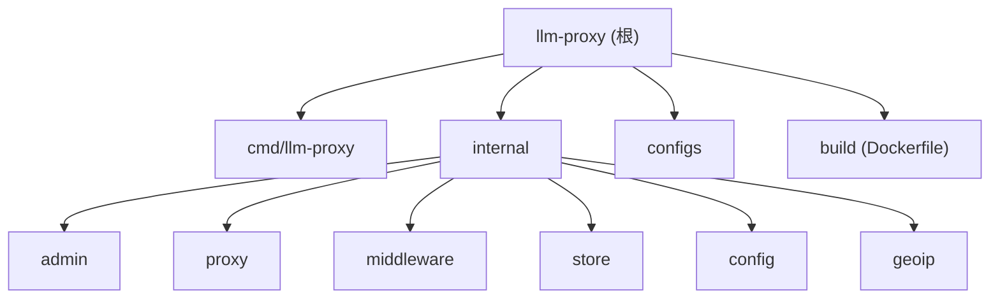

# LLM Proxy

> 最后更新：2026-05-15 15:03:30

## 项目愿景

一个用 Go 编写的轻量级 LLM API 透明反向代理，统一 `/v1/...` 端点，支持多上游路由、Key 管理、模型路由、失败自动切换、SQLite 持久化与内置中文 Web 管理面板。本仓库 fork 自上游 Instawork/llm-proxy，并在其基础上扩展了：

- 无 API Key 公益站上游接入（`api_keys` 可为空，鉴权头自动剥离）
- 上游备注字段 `remark`（管理员标注 Key 来源/用途）
- 失效 Key 自动禁用（连续 401/403/429 达阈值即停用，阈值可在线修改）
- 请求日志增加代理列、上游 Key 索引、模型名称等字段
- 上游配置可视化测试增强（无鉴权场景适配）

## 架构总览

```
客户端 (Bearer sk-xxx 或 x-api-key: sk-xxx)
   │
   ▼
CORSMiddleware              ← 仅作用于 /v1/
   │
StatsMiddleware             ← 全局 RPM/RPS 计数（最外层）
   │
RequestClassifier           ← 探测 OpenAI / Anthropic 风格 + 提取明文 Key
   │
KeyResolver                 ← 在 KeyCache 原子快照中查 SHA-256，401 拒绝无效/禁用
   │
PerKeyStats                 ← 已鉴权请求的 per-Key RPM 计数
   │
UpstreamBinding             ← 加载 Key 绑定上游集合 + per-Key 模型路由覆盖
   │
RateLimiter                 ← 滑动窗口 RPM 限流，429 超限
   │
AuditLog                    ← 异步批量写入 SQLite（可关闭）
   │
StreamingMiddleware         ← SSE 流式响应即时 flush
   │
ModelFilterMiddleware       ← 拦截 /v1/models 响应做白名单过滤
   │
DynamicProxy.ServeHTTP      ← 缓冲 body→提取 model→白名单(403)→模型模式过滤
                              →per-Key 覆盖(422)→鉴权头重写→按上游代理 RoundTrip
                              →非 2xx 时按 4xx 切换 + 调用 KeyFailCallback
                              →错误体脱敏后回写

UpstreamProber  (后台 goroutine) ← 定期 HEAD /v1/models 探活 + 重建 ActiveUpstream 快照
                                  ← AutoDisableFailingKeys 周期清理失效 Key
```

## 模块结构图



## 模块索引

| 模块路径 | 一句话职责 | 关键类型/入口 |
|---------|-----------|--------------|
| [cmd/llm-proxy](./cmd/llm-proxy/CLAUDE.md) | 程序入口：装配中间件链、注册路由、启动 HTTP/Prober/Audit | `main()` |
| [internal/admin](./internal/admin/CLAUDE.md) | 管理面板（HTML + JSON REST API），覆盖上游/Key/日志/白名单/设置 | `AdminHandler` |
| [internal/proxy](./internal/proxy/CLAUDE.md) | 反向代理核心：分类、路由、转发、上游探活、错误体脱敏 | `DynamicProxy`, `UpstreamProber`, `ActiveUpstream` |
| [internal/middleware](./internal/middleware/CLAUDE.md) | HTTP 中间件链：分类、鉴权、限流、绑定、审计、统计、白名单 | `KeyCache`, `PerKeyRPMLimiter`, `AuditLogger`, `ModelOverrideCache` |
| [internal/store](./internal/store/CLAUDE.md) | SQLite 持久层：上游/下游 Key/绑定/日志/白名单/设置 + AES-256-GCM 加密 | `Store`, `migrations` |
| [internal/config](./internal/config/CLAUDE.md) | YAML 配置加载（base + 环境覆盖）+ 默认值校验 | `YAMLConfig`, `LoadEnvironmentConfig` |
| [internal/geoip](./internal/geoip/CLAUDE.md) | 基于 MaxMind GeoLite2-City mmdb 的 IP 归属地查询（优雅降级） | `GeoIP.Lookup` |

## 运行与开发

```bash
# 构建
make build                              # → ./bin/llm-proxy
make build-linux                        # 交叉编译 Linux amd64

# 本地运行（必须设置环境变量）
ENCRYPTION_KEY=01234567890123456789012345678901 \
ADMIN_TOKEN=my-secret-token \
make dev                                # 直接 go run（开启 LOG_LEVEL=debug）

ENCRYPTION_KEY=... ADMIN_TOKEN=... make run   # 先 build 再跑

# Docker
make docker-build && make docker-run    # 开发镜像
make docker-compose-prod                # 生产模式（端口 80）

# 测试 / 质量
make test                               # 单元测试（带 -short -skip Integration）
make fmt && make vet && make check      # 格式化 + vet + lint
```

启动后入口：
- `http://localhost:9002/admin/` — 中文管理面板（需 ADMIN_TOKEN）
- `http://localhost:9002/healthz` — 存活探针
- `http://localhost:9002/readyz` — 就绪探针（无健康上游时返回 503）
- `http://localhost:9002/v1/...` — 透明代理（需下游 Key）

### 必需 / 可选环境变量

| 变量 | 必需 | 说明 |
|------|------|------|
| `ENCRYPTION_KEY` | 是 | 32 字节原文或 64 位十六进制；用于加密上游 Key、下游 Key 明文 |
| `ADMIN_TOKEN` | admin 启用时必需 | 管理 API 的 Bearer Token |
| `ENVIRONMENT` | 否 | dev/staging/production，决定加载 `configs/{env}.yml` |
| `PORT` | 否 | 覆盖配置文件端口 |
| `BIND_ADDR` | 否 | 监听地址，默认 `127.0.0.1` |
| `LOG_LEVEL` | 否 | debug/info/warn/error |
| `LOG_FORMAT` | 否 | text/json |
| `GEOIP_DB_PATH` | 否 | mmdb 文件路径，默认 `data/GeoLite2-City.mmdb` |

## 测试策略

- 框架：标准 `go test` + `github.com/stretchr/testify/{assert,require}`
- 风格：表驱动 + `t.TempDir()` 隔离 SQLite，避免相互污染
- 命名：`*_test.go` 与被测文件同包；`Test{Subject}_{Scenario}` 命名约定
- 推荐：`go test -race ./...`、`go test -cover ./...`
- 集成测试用 `Integration` 关键字命名，可被 `make test` 默认 skip

## 编码规范

源自 `~/.claude/rules/golang/`：

- `gofmt` / `goimports` 强制；接收接口、返回结构体；接口尽量小（1-3 方法）
- 错误用 `fmt.Errorf("ctx: %w", err)` 包裹返回；`context.Context` 用于超时/取消
- 中间件用闭包签名 `func(http.Handler) http.Handler`
- 凡需要在内存维护"运行时快照"的地方一律用 `atomic.Value` 写入并整体替换（见 KeyCache、ModelOverrideCache、ModelFilter、DynamicProxy.allUpstreams、AutoDisableThreshold）；禁止增量改写共享 map
- Context key 必须用包内私有 struct/类型（参见 `middleware/context.go`、`proxy/dynamic.go`）防止冲突与伪造
- 涉及上游网络 I/O 必须经过 `proxy.BuildTransport(proxyURL)`，复用按代理缓存的 `*http.Transport`
- 涉及外网 URL 校验必须经过 `validateBaseURL` / `validateProxyURL`（拒绝 loopback/private/link-local + 限制 scheme），防 SSRF
- 上游错误响应体必须经过 `SanitizeErrorBody` 脱敏后再回写客户端

## AI 使用指引

- 修改"中间件链顺序"前，请先阅读 [`cmd/llm-proxy/main.go` 的中间件装配段](./cmd/llm-proxy/CLAUDE.md)；顺序约束在注释中已说明，随意调换会破坏鉴权边界
- 增加新的 SQLite 列必须新增 `migration` 条目（不可改旧条目），见 [internal/store](./internal/store/CLAUDE.md)
- 新增管理 API：在 `AdminHandler.RegisterRoutes` 注册路由 + 同步更新本根文档"管理 API"段
- 增加上游响应敏感字段脱敏：在 `proxy/sanitize.go` 的 `sanitizeRules` 数组中追加规则（白名单式扩展点）
- 涉及 per-Key 模型路由覆盖逻辑变更，需同步：DB（key_model_overrides）+ ModelOverrideCache + DynamicProxy.matchModelOverrides
- 不要直接 `import` admin → middleware/proxy 之外的任何环路；admin 是顶层装配点

## 变更记录 (Changelog)

- 2026-05-15 15:03:30：初始化 CLAUDE.md 体系（根 + 7 个模块），覆盖现有架构与 fork 扩展（无鉴权上游、Key 自动禁用、备注字段、日志代理列）

<!-- rtk-instructions v2 -->
# RTK (Rust Token Killer) - Token-Optimized Commands

## Golden Rule

**Always prefix commands with `rtk`**. If RTK has a dedicated filter, it uses it. If not, it passes through unchanged. This means RTK is always safe to use.

**Important**: Even in command chains with `&&`, use `rtk`:
```bash
# ❌ Wrong
git add . && git commit -m "msg" && git push

# ✅ Correct
rtk git add . && rtk git commit -m "msg" && rtk git push
```

## RTK Commands by Workflow

### Build & Compile (80-90% savings)
```bash
rtk cargo build         # Cargo build output
rtk cargo check         # Cargo check output
rtk cargo clippy        # Clippy warnings grouped by file (80%)
rtk tsc                 # TypeScript errors grouped by file/code (83%)
rtk lint                # ESLint/Biome violations grouped (84%)
rtk prettier --check    # Files needing format only (70%)
rtk next build          # Next.js build with route metrics (87%)
```

### Test (60-99% savings)
```bash
rtk cargo test          # Cargo test failures only (90%)
rtk go test             # Go test failures only (90%)
rtk jest                # Jest failures only (99.5%)
rtk vitest              # Vitest failures only (99.5%)
rtk playwright test     # Playwright failures only (94%)
rtk pytest              # Python test failures only (90%)
rtk rake test           # Ruby test failures only (90%)
rtk rspec               # RSpec test failures only (60%)
rtk test <cmd>          # Generic test wrapper - failures only
```

### Git (59-80% savings)
```bash
rtk git status          # Compact status
rtk git log             # Compact log (works with all git flags)
rtk git diff            # Compact diff (80%)
rtk git show            # Compact show (80%)
rtk git add             # Ultra-compact confirmations (59%)
rtk git commit          # Ultra-compact confirmations (59%)
rtk git push            # Ultra-compact confirmations
rtk git pull            # Ultra-compact confirmations
rtk git branch          # Compact branch list
rtk git fetch           # Compact fetch
rtk git stash           # Compact stash
rtk git worktree        # Compact worktree
```

Note: Git passthrough works for ALL subcommands, even those not explicitly listed.

### GitHub (26-87% savings)
```bash
rtk gh pr view <num>    # Compact PR view (87%)
rtk gh pr checks        # Compact PR checks (79%)
rtk gh run list         # Compact workflow runs (82%)
rtk gh issue list       # Compact issue list (80%)
rtk gh api              # Compact API responses (26%)
```

### JavaScript/TypeScript Tooling (70-90% savings)
```bash
rtk pnpm list           # Compact dependency tree (70%)
rtk pnpm outdated       # Compact outdated packages (80%)
rtk pnpm install        # Compact install output (90%)
rtk npm run <script>    # Compact npm script output
rtk npx <cmd>           # Compact npx command output
rtk prisma              # Prisma without ASCII art (88%)
```

### Files & Search (60-75% savings)
```bash
rtk ls <path>           # Tree format, compact (65%)
rtk read <file>         # Code reading with filtering (60%)
rtk grep <pattern>      # Search grouped by file (75%). Format flags (-c, -l, -L, -o, -Z) run raw.
rtk find <pattern>      # Find grouped by directory (70%)
```

### Analysis & Debug (70-90% savings)
```bash
rtk err <cmd>           # Filter errors only from any command
rtk log <file>          # Deduplicated logs with counts
rtk json <file>         # JSON structure without values
rtk deps                # Dependency overview
rtk env                 # Environment variables compact
rtk summary <cmd>       # Smart summary of command output
rtk diff                # Ultra-compact diffs
```

### Infrastructure (85% savings)
```bash
rtk docker ps           # Compact container list
rtk docker images       # Compact image list
rtk docker logs <c>     # Deduplicated logs
rtk kubectl get         # Compact resource list
rtk kubectl logs        # Deduplicated pod logs
```

### Network (65-70% savings)
```bash
rtk curl <url>          # Compact HTTP responses (70%)
rtk wget <url>          # Compact download output (65%)
```

### Meta Commands
```bash
rtk gain                # View token savings statistics
rtk gain --history      # View command history with savings
rtk discover            # Analyze Claude Code sessions for missed RTK usage
rtk proxy <cmd>         # Run command without filtering (for debugging)
rtk init                # Add RTK instructions to CLAUDE.md
rtk init --global       # Add RTK to ~/.claude/CLAUDE.md
```

## Token Savings Overview

| Category | Commands | Typical Savings |
|----------|----------|-----------------|
| Tests | vitest, playwright, cargo test | 90-99% |
| Build | next, tsc, lint, prettier | 70-87% |
| Git | status, log, diff, add, commit | 59-80% |
| GitHub | gh pr, gh run, gh issue | 26-87% |
| Package Managers | pnpm, npm, npx | 70-90% |
| Files | ls, read, grep, find | 60-75% |
| Infrastructure | docker, kubectl | 85% |
| Network | curl, wget | 65-70% |

Overall average: **60-90% token reduction** on common development operations.
<!-- /rtk-instructions -->